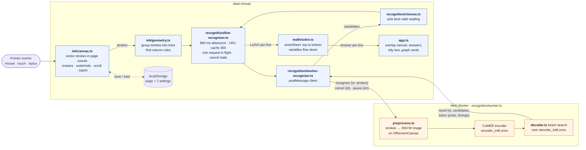
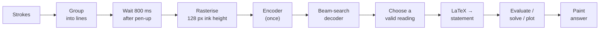
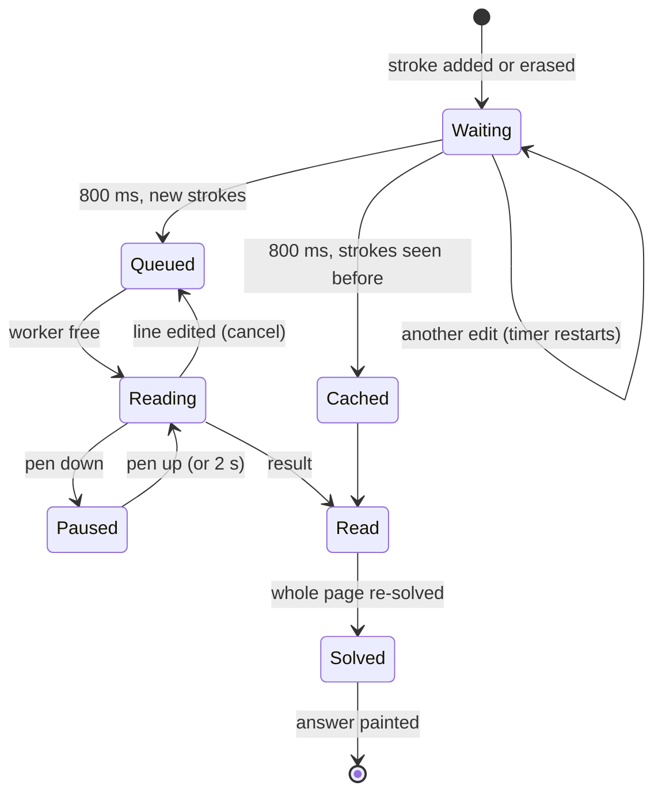
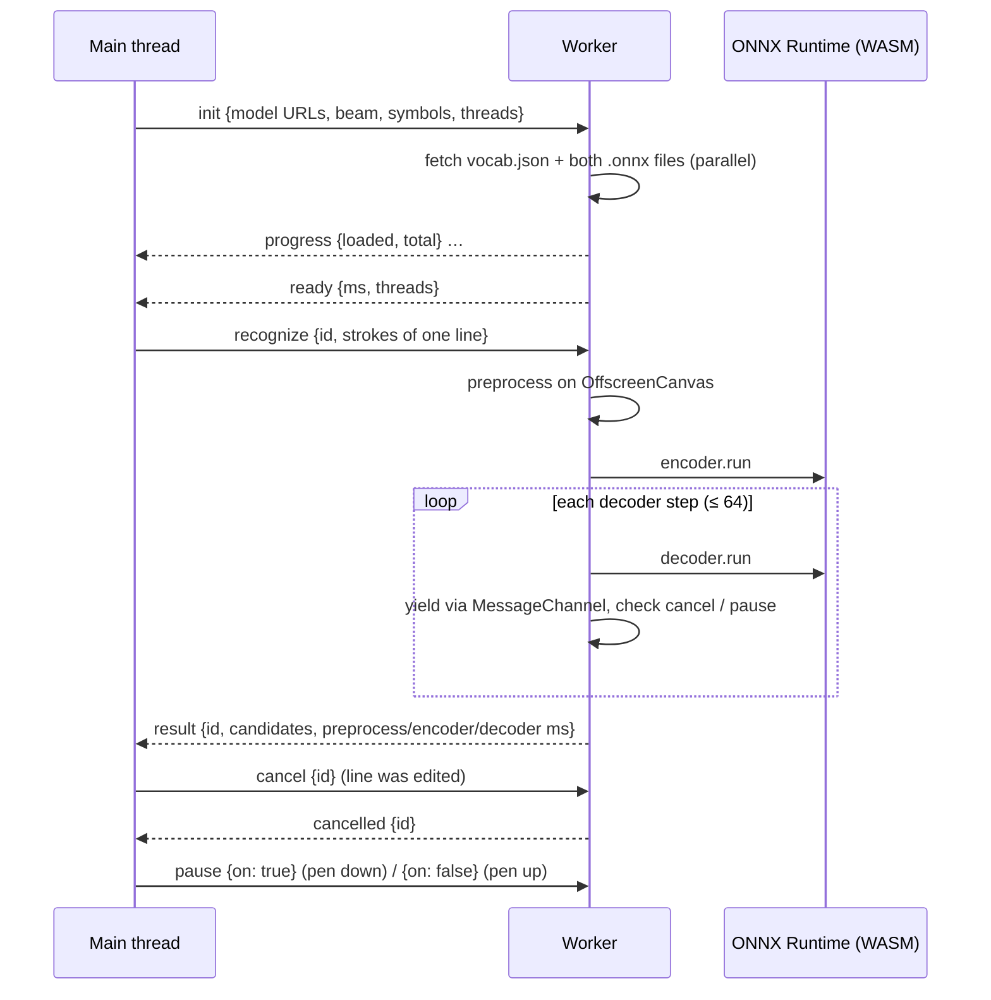
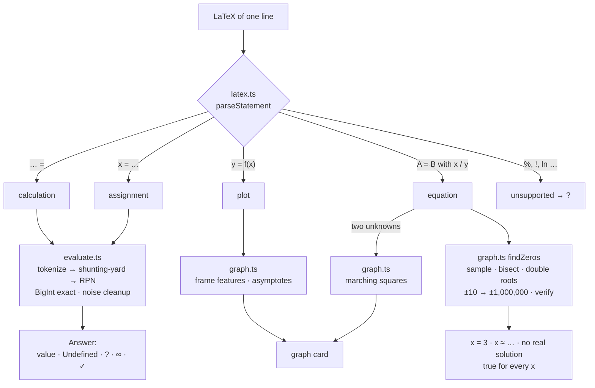

<div align="center">


# CalcInk

### Write the math. Get the answer beside it.

A handwriting calculator that runs entirely in your browser. Write a calculation, end it with **`=`**, and the answer is written next to it. The handwriting model runs on your device, nothing is sent to a server, and after the first load it works with the internet off.

<br/>

[](https://calcink-gamma.vercel.app/)
[](https://www.typescriptlang.org/)
[](https://vitejs.dev)
[](https://github.com/microsoft/onnxruntime)
[](#the-model)
[](#privacy-and-offline)
[](#testing)
[](LICENSE)

**[Open the live demo →](https://calcink-five.vercel.app/)** &nbsp;·&nbsp; [mirror](https://software-dev-bootcamp-prince-4vuw.vercel.app/) &nbsp;·&nbsp; [repository](https://github.com/DivyamCS/Software_dev_bootcamp)

[PS checklist](#problem-statement-checklist) · [Features](#features) · [Architecture](#architecture) · [The model](#the-model) · [Quick start](#quick-start) · [Usage](#usage) · [Testing](#testing) · [Limitations](#limitations) · [Credits](#credits-and-licences)

</div>

---

## Overview

Built for the Inter IIT Bootcamp (IIT Guwahati Tech Board), Software PS Phase 1: *CalcInk: On-Device Handwritten Math Calculator*.

CalcInk works like a page in a notebook. Write a sum by hand and finish it with `=`, and the answer appears beside it in a handwriting font. Fix a digit and the answer updates. Write `x = 10` on one line and `x + 5 =` below it, and you get `15`. Turn graphs on and `y = x² − 4` becomes a small graph with its roots marked. Reload the page and your work is still there.

```text
18 + 4 × 3 =      30                 √144 + 3² =        21
9 ÷ 0 =           Undefined          2x + 4 = 10        x = 3
x = 10                               x² − 5x + 6 = 0    x = 2, 3
x + 5 =           15                 2x = 2x            true for every x
7 + 8 = 15        ✓                  x² + y² = 25       (circle drawn)
```

---

## Problem statement checklist

| Requirement | How CalcInk meets it | Verified by |
|---|---|---|
| Mouse, touch and stylus input | One Pointer Events code path; pressure, pen eraser end, palm rejection | Mouse: every browser test · touch: `tests/e2e/scroll.spec.ts` · stylus: by hand |
| Smooth curves | Coalesced pointer events + quadratic Béziers through midpoints | By hand (`src/ink/render.ts`) |
| Undo / redo | Bounded snapshot history (200 steps); one gesture = one step | `src/ink/history.test.ts`, `app.spec.ts` |
| Stroke eraser and pixel eraser | Segment hit-test / vector rub-out that splits strokes (plus a scribble eraser) | `src/ink/geometry.test.ts`, `app.spec.ts` |
| Clear, stroke width | Clear is an undoable step; width slider and `[` `]` | `app.spec.ts` |
| HiDPI (`devicePixelRatio`) | Backing store = CSS size × DPR, rebuilt when DPR changes | `src/ink/coords.test.ts`, `app.spec.ts` (DPR 2) |
| Recognise `0–9 + − × ÷ . =` with an open-source pre-trained model in the client | CoMER (INT8 ONNX) on onnxruntime-web, in a Web Worker | `tests/e2e/accuracy.spec.ts` (97.5 %) |
| BODMAS evaluator: multi-digit, decimals, negatives | Own tokenizer → shunting-yard → RPN evaluator, BigInt-exact integers | `src/math/evaluate.test.ts` |
| Answer drawn next to `=`, re-evaluated on edit | Overlay canvas, right of the line; edited lines are re-read and the page re-solved | `app.spec.ts`, `src/recognition/line-recognizer.test.ts` |
| 100 % on-device, offline | No backend; same-origin model and runtime; service worker precache | `tests/e2e/offline.spec.ts`, `tests/safety.test.ts` |
| 60 FPS while recognising | Inference in a worker, decoding pauses while the pen is down | `tests/e2e/performance.spec.ts` |
| No `eval` | Hand-written parser; a unit test fails the build on `eval` / `Function(` | `tests/safety.test.ts` |
| `Undefined` for ÷ 0, no crashes | Errors are returned as values, never thrown | `evaluate.test.ts`, `tests/e2e/fuzz.spec.ts` |

---

## Features

### Writing

- **Mouse, touch and stylus** through one Pointer Events code path.
- **Stylus:** pressure changes line width, the pen's eraser end works as the pixel eraser, and touches within 800 ms of the pen are ignored (palm rejection).
- **Smooth, sharp ink:** coalesced pointer events for fast strokes, Bézier smoothing, and canvases scaled by `devicePixelRatio`, so lines stay crisp on HiDPI screens and after browser zoom.
- **Three erasers:** stroke eraser (whole strokes), pixel eraser (rubs out part of a stroke) and scribble eraser. Scribbling over writing with the normal pen also erases it.
- **Undo, redo and clear** (clear can be undone too), six pen colours and a width slider.
- **A page that scrolls both ways:** mouse wheel, two-finger swipe, `PageUp` / `PageDown` or the scrollbar. There is always fresh paper below your writing, and if the window gets narrower than your writing (browser zoom, resizing) the page also scrolls sideways, so nothing is lost off the right edge.
- **Your page is kept.** It is saved in the browser 400 ms after each change, so a reload doesn't lose your work.
- **Paper styles:** lined, squared, dotted or plain.

### Recognition

- **Reads a whole line at once**, so multi-stroke symbols (`=`, `÷`, `+`), decimal points and touching digits need no hand-written segmentation rules.
- **Many calculations per page.** Strokes are grouped into lines, and a wide gap on the same row splits it into two separate calculations.
- **Only reads when you pause:** 800 ms after you lift the pen, never while you're drawing.
- **Restricted vocabulary.** The model can only output symbols we can calculate with, which makes it more accurate and its confidence more meaningful.
- **Confidence warning.** If the least certain symbol is below 60 %, the answer gets a dotted underline and the status bar shows what was read, e.g. `read: 12 + 34 = · 97% sure · 640 ms`.
- **Per-line cache.** Undo, redo and editing another line never re-read lines that didn't change.
- **Any writing size.** Lines taller than 110 px are scaled down before reading and stroke width is normalised, so big writing on a phone reads like normal writing.

### Math

- **Order of operations (BODMAS):** brackets, powers (right-associative), unary minus, `× ÷`, then `+ −`.
- **Numbers:** multi-digit, decimals, negatives, implicit multiplication like `2(3+4)` and `2π`. Whole numbers are exact up to 40 digits (`99999999 × 99999999 = 9999999800000001`), and floating-point noise is removed (`0.1 + 0.2 = 0.3`).
- **Functions and constants:** `√`, powers, fractions, `sin`, `cos`, `tan` (radians; the status bar says so), `log` (base 10), `π`, `e`. Odd roots of negatives are real: `(−8)^(1/3) = −2`.
- **Variables that carry down the page:** `x = 10`, then `x + 5 =` gives `15`. Change the `10` and every line below updates instantly, with no model run.
- **Formulas:** after `y = x²`, any line below where `x` has a value also knows `y` (`x = 3`, then `y + 1 =` gives `10`).
- **Equation solving** in one unknown: `2x + 4 = 10` gives `x = 3`, `x² = 2` gives `x ≈ −1.414, 1.414`, `2x = 2x` gives `true for every x`, `x² + 1 = 0` gives `no real solution`. Roots are searched up to ±1,000,000 and every root is checked against the original equation before it is shown.
- **Checking your work:** write the answer yourself and CalcInk ticks it if it's right (`7 + 8 = 15` → ✓) or shows the correct value if not.
- **Column sums:** stack numbers with their signs, draw a line under them, and the total appears below. The line may be slightly tilted.
- **Errors never crash anything:** `9 ÷ 0` shows `Undefined`, overflow shows `∞`, and anything unreadable shows `?` with the reason in the status bar.
- **No `eval`, ever.** A unit test fails the build if `eval` or `Function(` appears in the source.

### Graphs (press `G`)

| You write | You get |
|---|---|
| `y = x² − 4`, `y = sin x`, `y = 1/x` | A graph card with roots, turning points and the y-intercept marked. The view frames itself around them, and the curve is split at asymptotes. |
| `x² + y² = 25`, `x = sin y` | An implicit curve traced with marching squares, with equal axes so circles stay round. |
| `2x + 4 = 10`, `sin x = x/2` | The solution, plus a graph of both sides with the crossing points marked. |
| `x = 5` / `y = 2` | Sets the variable and draws a vertical / horizontal line. A value of `x` written below `y = f(x)` is marked on its curve. |

Graph cards go in the nearest free spot so they never cover your writing, shrink on a crowded page, and fade when you write over them. All graphing is our own code; no plotting library is used.

### Display

- **Handwritten answers** in the bundled Caveat font, revealed left to right. `prefers-reduced-motion` turns the animation off.
- **Tidy mode (`T`):** shows each line as clean typed text over your ink. Your strokes come back when you pick an eraser.
- **No flicker:** an edited line keeps its old answer faded until the new one is ready.
- **Status bar:** model loading progress, then `Ready · runs entirely on your device` or `Ready · working offline`, plus the last reading and the reason behind any `?`.

---

## Architecture

### System overview

Two threads, two canvases. The main thread never runs the model; the worker never touches the DOM.



| Design decision | Reason |
|---|---|
| **All model work in a Web Worker** (rasterising, encoder, decoder) | The main thread only draws, schedules and solves, so the pen stays at 60 FPS while a line is read. The main bundle is 86 KB and never loads onnxruntime. |
| **Two stacked canvases**: ink below, overlay above | Answers, tidy text and graphs are never ink, so they can't be erased by accident or fed back into the model, and repainting them is cheap. |
| **Strokes stored as vectors in page coordinates** | Undo is a pointer swap, the pixel eraser stays exact, scrolling is a transform, and the model sees exactly what the user sees. |
| **Recognition is cached, solving is not** | What the model read is cached per line (keyed by the line's strokes). The whole page is re-solved from those readings on every change, which takes microseconds and is why variables update instantly. |
| **Pen down pauses the worker** | While you draw, decoding stops between steps (at most 2 s), so the model never competes with your stroke for the CPU. |

### From handwriting to an answer



| # | Step | What happens, exactly | File |
|---|---|---|---|
| 1 | Group | Strokes merge into a line by padded vertical overlap (padding scales with median glyph height, so a tall `(` or a superscript doesn't split a line). A row splits where the horizontal gap is wider than 3 glyph heights. A long, flat stroke with stacked numbers above it is a column rule. | `ink/geometry.ts` |
| 2 | Schedule | A line is read 800 ms after the last pen-up and never while the pen is down. One request at a time, top to bottom. If the line changes, its request is cancelled in the worker and a late result is dropped. Readings are cached per line (LRU, 300 entries). | `recognition/line-recognizer.ts` |
| 3 | Rasterise | In the worker: bounding box + 16 px padding, lines taller than 110 px scaled down to 110 px, strokes resampled every 3 px and drawn white on black with a normalised ~5 px width, scaled to 128 px high (≤ 1024 px wide), pasted into a canvas 256 px high with width a multiple of 64. Output: `float32 [1, 1, 256, W]` plus a `bool [1, 256, W]` padding mask. | `recognition/preprocess.ts` |
| 4 | Encode | `encoder.run({pixel_values, pixel_mask})` → image features and their mask. Runs once per line. | `recognition/worker.ts` |
| 5 | Decode | Our beam search (width 1–3 by device) calls `decoder.run({encoder_features, encoder_mask, input_ids})` step by step, up to 64 steps. Log-probabilities are renormalised over the allowed symbols only; runs of up to 12 identical tokens are allowed; GNMT length penalty α = 0.6. Every token's probability is kept. | `recognition/decoder.ts` |
| 6 | Choose | Prefers a candidate that is a valid calculation when it is nearly as likely as the top one. Confidence = probability of the least certain token that matters. | `recognition/choose.ts` |
| 7 | Interpret | LaTeX → statement: `… =` calculation (with an optional answer to check), `x = …` assignment, `y = f(x)` plot, `A = B` with `x`/`y` equation. `\cdot` before a digit is a decimal point; `x` between two numbers is `×`. | `math/latex.ts` |
| 8 | Compute | Lines solved top to bottom with an environment of variables. Expressions go through tokenizer → shunting-yard → RPN, compiled once. Equations: sample `left − right`, bisect sign changes, find touching roots, widen ±10 → ±1,000,000, verify each root. | `math/solve.ts`, `evaluate.ts`, `graph.ts` |
| 9 | Paint | Answer written to the right of the line at the line's handwriting size. Graph cards placed by a grid search for the nearest free spot. Column totals right-aligned under the rule. | `app.ts`, `place.ts`, `math/column.ts` |

### Life of one line



### Worker protocol



- Requests and responses are typed in `recognition/protocol.ts`. Every failure comes back as `init-error` or `error`, never as an unhandled exception.
- Between decoder steps the worker yields through a `MessageChannel` (never throttled like `setTimeout`), so a cancel or pause is seen within one step.
- ONNX tensors are disposed in `finally` blocks after every run. Tiny specks and taps are filtered out before any model run.

### Math engine



The page is solved top to bottom (`solveSheet`). Each line sees the variables defined above it, so `x = 10` on line 1 makes `x + 5 =` on line 2 give `15`, and a second `x = 20` further down only affects the lines below it.

<details>
<summary><b>Performance techniques</b></summary>

<br/>

| Technique | Why |
|---|---|
| Inference in a Web Worker, rasterising on `OffscreenCanvas` | The main thread only draws |
| No reading while the pen is down, 800 ms debounce, decoder pauses on pen-down | No CPU spent on results that are stale a moment later, and no competition with the stroke being drawn |
| Per-line LRU cache (300) and one request in flight | Editing one line never re-reads the others |
| Cancellation between decoder steps | Abandoned lines stop using CPU within one step |
| Threads = half the cores (max 4); beam 1 on ≤ 2 GB RAM, 2 on ≤ 4 cores, else 3 | Leaves cores for the UI and compositor, adapts to weak devices |
| Opaque status pill, status-dot pulse paused while drawing | Removed a per-frame backdrop blur that dropped drawing to ~30 FPS on 2 cores |
| `requestAnimationFrame`-batched repaints, allocation-free evaluator for graphs | Smooth frames, no garbage-collection pauses |
| Bounded undo history (200) sharing stroke objects, graph samples in a `WeakMap` | Flat memory over long sessions |

</details>

---

## The model

We did not train a model. CalcInk uses **CoMER** (*Modeling Coverage for Transformer-based Handwritten Mathematical Expression Recognition*, Zhao & Gao, ECCV 2022), an image-to-LaTeX model trained by its authors on the CROHME dataset.

**Architecture.** A **DenseNet encoder** turns the line image into a grid of feature vectors. A **Transformer decoder** then writes the LaTeX one token at a time, attending to those features. CoMER's addition is the **Attention Refinement Module**, which tracks *coverage*: which parts of the image have already been attended to, so a symbol is neither skipped nor read twice. The paper reports 59.3 / 59.8 / 63.0 % expression accuracy on CROHME 2014 / 2016 / 2019, a benchmark full of integrals and sums that is much harder than arithmetic.

| | |
|---|---|
| **Source** | Paper: [arXiv:2207.04410](https://arxiv.org/abs/2207.04410) · code: [Green-Wood/CoMER](https://github.com/Green-Wood/CoMER) · ONNX export: [kimseungdae/ink-on](https://github.com/kimseungdae/ink-on) |
| **Files** | `public/models/comer/encoder_int8.onnx` (3.5 MB), `decoder_int8.onnx` (4.1 MB), `vocab.json` (113 tokens). 7.6 MB in total, about 13× smaller than the FP32 original. |
| **Format** | INT8-quantised ONNX |
| **Inputs / outputs** | Encoder: `pixel_values float32 [1,1,256,W]`, `pixel_mask bool [1,256,W]`. Decoder: `encoder_features`, `encoder_mask`, `input_ids int64 [1,t]` → next-token logits over 113 tokens. |
| **Runtime** | onnxruntime-web 1.30.0, WebAssembly backend (SIMD, multi-threaded when the page is cross-origin isolated), inside a Web Worker |
| **Licence** | CoMER: no licence file in its repository (rights stay with the authors; used unmodified, with credit, non-commercially). ink-on export and preprocessing: Apache-2.0. See [`NOTICE.md`](NOTICE.md). |
| **Our code around it** | line grouping, preprocessing changes, beam-search decoder, vocabulary restriction, candidate choice, and everything after the LaTeX |

**Why CoMER.** It reads a whole line at once, so we don't need to cut the ink into single symbols, which is exactly where per-symbol classifiers fail (`=`, `÷` and `+` are several strokes and a decimal point is a dot next to a digit). It is also small enough to ship. The alternatives we considered:

| Option | Why not |
|---|---|
| Per-symbol CNN (MNIST / HASYv2 style) + our own segmentation | Accuracy would depend on hand-made segmentation heuristics, and their errors are silent |
| TrOCR (Transformers.js) | Tens to hundreds of MB, slow on CPU, made for text rather than math |
| Tesseract.js | Built for printed text, weak on handwriting and math symbols |
| BTTR and other HMER research models | No browser-ready export; CoMER is BTTR's follow-up by the same authors |
| Cloud OCR (Mathpix, MyScript, Google Vision) | Not allowed: everything must run on the device |

**Why our own decoder.** ink-on's decoder ends a hypothesis after 3 identical tokens, so `10000` or `1111` could never be read. Ours allows runs of 12, keeps every token's probability for the confidence warning, restricts the output to calculable symbols, and can be cancelled or paused between steps.

**Allowed symbols** (`?symbols=` in the URL):

| Mode | Symbols |
|---|---|
| `extended` (default) | everything in `arithmetic`, plus `x`, `y`, `√`, `π`, `sin`, `cos`, `tan`, `log`, `e` |
| `arithmetic` | digits, `+ − × ÷ / · . = ( )`, fractions, powers |
| `full` | the whole 113-token vocabulary (for troubleshooting) |

### Measured results

| Measurement | Result |
|---|---|
| Accuracy on 120 synthetic handwritten calculations (40 expressions × 3 seeds) | **117 / 120 (97.5 %)**, vs 112 / 120 with ink-on's decoder |
| Variables and graph lines read correctly | 33 / 33 |
| Time to read one line (beam 3, 2-core machine): median / p95 | **835 ms** / 1217 ms |
| Frame time while drawing *and* recognising | **16.7 ms median (60 FPS)**, no main-thread task over 50 ms |
| Memory after 24 written-and-cleared pages | +0.4 MB heap after GC (flat) |
| Same answers for writing from 30 px to 350 px tall | yes |

> The accuracy test uses seeded synthetic handwriting, so treat it as a regression check, not a real-world score. Full method, the misses and every measurement are in [`docs/DESIGN.md`](docs/DESIGN.md).

---

## Quick start

**Easiest:** open the **[live demo](https://calcink-gamma.vercel.app/)** in Chrome, Edge, Firefox or Safari and wait for the status bar to say **Ready**. The first visit downloads about 22 MB (WASM runtime 14 MB + model 7.6 MB). After that it also works with the internet off.

**From source:** you need [Node.js](https://nodejs.org) 18 or newer. The model files are already in the repo.

```bash
git clone https://github.com/DivyamCS/Software_dev_bootcamp.git calcink
cd calcink
npm install        # also copies the WASM runtime into public/ort/
npm run dev        # open http://localhost:5173
```

<details>
<summary><b>Running it on Windows or Mac, online or offline</b></summary>

<br/>

| | Windows | Mac |
|---|---|---|
| **Online** | Open the live demo in Chrome or Edge. Optional: click *Install* in the address bar. | Open the live demo in Safari or Chrome. Optional: Safari → File → *Add to Dock*. |
| **Offline (from source)** | Install Node.js LTS (`.msi`) and Git. In **Command Prompt** or Git Bash, while online: `git clone …`, `cd calcink`, `npm install`, `npm run build`. Then, with the internet off: `npm run preview` and open http://localhost:4173. | Install Node.js LTS (`.pkg` or `brew install node`) and Git (`xcode-select --install`). In Terminal, while online: `git clone …`, `cd calcink`, `npm install`, `npm run build`. Then, with Wi-Fi off: `npm run preview` and open http://localhost:4173. |

On Windows, if PowerShell says `npm` "cannot be loaded because running scripts is disabled", use Command Prompt or type `npm.cmd` instead.

</details>

| Command | What it does |
|---|---|
| `npm run dev` | Dev server, with the COOP/COEP headers needed for multi-threaded WASM |
| `npm run build` | Type-check, then production build into `dist/` |
| `npm run preview` | Serve the production build on port 4173. Use this to test offline mode. |
| `npm test` | Unit tests (Vitest) |
| `npm run test:e2e` | Browser tests with the real model (Playwright). Run `npx playwright install chromium` the first time. |
| `npm run test:all` | Unit tests, build, then browser tests |
| `npm run typecheck` | `tsc --noEmit` |
| `npm run models` | Re-download the model files |

**Check offline mode yourself:** `npm run build && npm run preview`, open the page once, set DevTools → Network to *Offline*, reload, and write something.

**Deploying:** any static host works. On Vercel, import the repo with the Vite preset; `vercel.json` already sets the `Cross-Origin-Opener-Policy` / `Cross-Origin-Embedder-Policy` headers and long-term caching for `/models` and `/ort`. On other hosts add the same two headers. Without them CalcInk still works, just single-threaded.

**URL options:** `?delay=500` (pause before reading, ms) · `?beam=1..5` · `?symbols=arithmetic|extended|full` · `?lp=0..2` (length penalty).

<details>
<summary><b>Troubleshooting</b></summary>

<br/>

- **Answers never appear / "Model failed to load":** check that `public/models/comer/` has `encoder_int8.onnx`, `decoder_int8.onnx` and `vocab.json`. `npm run models` re-downloads them.
- **404 for `/ort/*.wasm`:** run `node scripts/copy-ort.mjs`.
- **Port 4173 already in use:** `npm run preview -- --port 4180`.
- **Digits misread:** write a little more slowly and clearly, or try `?symbols=arithmetic` or `?beam=5`.
- **Old version after a deploy:** the service worker updates itself; reload once more.
- **Want a blank page:** use Clear (it can be undone).

</details>

---

## Usage

1. Wait for the status bar to say **Ready** (only the first visit downloads the model).
2. Write a calculation and **end it with `=`**.
3. Lift the pen. After a 0.8 s pause the line is read (about 0.8 s on a 2-core laptop) and the answer appears. A dotted underline means the model wasn't sure about a symbol.
4. Edit freely: erase or rewrite a digit and the answer updates. Fill the page with as many lines as you like.
5. Try variables (`x = 10`, then `x + 5 =`), equations (`2x + 4 = 10`), checking (`7 + 8 = 15`), graphs (press `G`, then `y = x² − 4`) and column sums.

| Key | Action | Key | Action |
|---|---|---|---|
| `P` | Pen | `T` | Tidy text on/off |
| `E` | Stroke eraser | `G` | Graphs on/off |
| `R` | Pixel eraser | `C` | Next pen colour |
| `S` | Scribble eraser | `B` | Next paper style |
| `[` / `]` | Thinner / thicker pen | `Ctrl/⌘ + Z` | Undo |
| `PageUp` / `PageDown` | Scroll | `Ctrl/⌘ + Shift + Z` or `Ctrl/⌘ + Y` | Redo |
| `Shift + wheel` | Scroll sideways | `Esc` | Close menus |

### Example expressions

Each of these was run through CalcInk's LaTeX-to-answer path.

| You write | CalcInk shows |
|---|---|
| `18 + 4 × 3 =` | `30` |
| `(18 + 4) × 3 =` | `66` |
| `√144 + 3² =` | `21` |
| `2(3 + 4) =` | `14` |
| `3/4 + 0.25 =` (stacked fraction) | `1` |
| `0.1 + 0.2 =` | `0.3` |
| `99999999 × 99999999 =` | `9999999800000001` |
| `(−8)^(1/3) =` | `−2` |
| `sin(π/6) =` | `0.5` |
| `log 1000 =` | `3` |
| `9 ÷ 0 =` | `Undefined` |
| `7 + 8 = 15` | `✓` |
| `x = 10`, then `x + 5 =` | `15` |
| `2x + 4 = 10` | `x = 3` |
| `x² − 5x + 6 = 0` | `x = 2, 3` |
| `x² + 1 = 0` | `no real solution` |
| `2x = 2x` | `true for every x` |
| `y = x² − 4`, `x² + y² = 25` | graph cards (graphs on) |

---

## Privacy and offline

| Question | Answer |
|---|---|
| Where does recognition run? | In a Web Worker in your browser (ONNX Runtime Web, WebAssembly). There is no backend. |
| Does my handwriting leave the device? | No. The worker only loads same-origin files (`models/comer/*`, `ort/*`). `tests/safety.test.ts` fails if any `http(s)://` URL appears in the source, and `tests/e2e/offline.spec.ts` fails on any request to another origin. |
| Does it work offline? | Yes, after the first visit. A service worker (Workbox via vite-plugin-pwa) precaches the app, the WASM runtime, the model and the font, and takes control on that first visit. |
| What is stored? | In this browser's `localStorage` only: the current page's strokes (so a reload keeps your work) and two settings (graphs on/off, paper style). Nothing is uploaded. |

---

## Tech stack

| Layer | Technology |
|---|---|
| Language | TypeScript 5.9 (strict, ES2022) |
| UI | Vanilla DOM + Canvas 2D, plain CSS (no framework) |
| Build | Vite 5.4, ES-module Web Workers |
| Offline | vite-plugin-pwa 0.20 (Workbox) |
| Model / runtime | CoMER (INT8 ONNX) on onnxruntime-web 1.30.0 (WASM) |
| Math and graphs | Our own code: shunting-yard, BigInt exactness, bisection, marching squares |
| Font | Caveat via `@fontsource/caveat` (bundled for offline use) |
| Tests | Vitest 2.1, Playwright 1.56 |
| CI / hosting | GitHub Actions; Vercel (any static host works) |

---

## Project structure

```text
calcink/
├── index.html                    page shell, toolbar, status bar
├── vite.config.ts                COOP/COEP headers, onnxruntime alias, PWA precache
├── playwright.config.ts          browser tests against the production build
├── vercel.json                   COOP/COEP headers, caching for /models and /ort
├── .github/workflows/ci.yml      type-check, unit tests and build on every push
├── docs/DESIGN.md                design notes, alternatives tried, measurements
├── NOTICE.md                     third-party credits and licences
├── public/
│   ├── models/comer/             encoder_int8.onnx · decoder_int8.onnx · vocab.json
│   └── icon.svg · icon-192.png · icon-512.png
├── scripts/
│   ├── copy-ort.mjs              copies the WASM runtime to public/ort on install
│   └── fetch-models.mjs          downloads the model files only if missing
├── src/
│   ├── main.ts                   entry: URL options, worker, service worker
│   ├── app.ts                    toolbar, shortcuts, status bar, answers, graph cards, page saving
│   ├── place.ts                  free-space search for graph cards
│   ├── reveal.ts                 when error marks may appear
│   ├── feedback.ts               vibration when an answer lands
│   ├── style.css
│   ├── ink/
│   │   ├── canvas.ts             pointer input, erasers, scrolling, HiDPI, save/load
│   │   ├── coords.ts             client → CSS px → page coordinates
│   │   ├── geometry.ts           bounding boxes, hit tests, line grouping, column rules
│   │   ├── history.ts            bounded undo/redo
│   │   ├── render.ts             Bézier stroke rendering with pressure
│   │   ├── scratch.ts            scribble-to-erase detection
│   │   └── types.ts
│   ├── recognition/
│   │   ├── worker.ts             Web Worker: loads ONNX sessions, runs encoder + decoder
│   │   ├── preprocess.ts         strokes → image tensor + mask
│   │   ├── decoder.ts            beam search, vocabulary mask, length penalty
│   │   ├── vocab.ts              vocabulary and allowed symbol sets
│   │   ├── protocol.ts           typed worker messages
│   │   ├── worker-recognizer.ts  main-thread client for the worker
│   │   ├── line-recognizer.ts    per-line scheduling, cache, cancellation
│   │   ├── choose.ts             picks the best valid reading
│   │   └── types.ts
│   └── math/
│       ├── latex.ts              LaTeX → statement
│       ├── evaluate.ts           tokenizer, shunting-yard, RPN evaluator
│       ├── solve.ts              page solver: variables, equations, checks
│       ├── graph.ts              roots, framing, marching squares
│       ├── column.ts             column sums
│       └── display.ts            answer and tidy-text formatting
└── tests/
    ├── safety.test.ts            no eval / Function / external URLs
    └── e2e/                      Playwright specs, fixtures, synthetic handwriting
```

Unit tests sit next to the files they test (`*.test.ts`).

---

## Testing

| Suite | What it covers |
|---|---|
| **Unit** (Vitest, 428 tests) | Evaluator (precedence, decimals, big numbers, ÷ 0, junk input, injection strings), LaTeX mapping, variables and the page solver, equations and graphs, column sums, card placement, the decoder against a fake model, preprocessing, coordinates at DPR 1–3, erasers, history, the recognition scheduler, and the safety scan |
| **Browser** (Playwright, 63 tests, production build, real model) | Writing and editing, undo/redo, erasers, variables, graphs, column sums, layout (cards never cover ink), scrolling, phone-sized screens, offline mode, no outside requests, frame timing, memory over a long session, accuracy, pixel parity with ink-on's preprocessing, and a seeded fuzz test |
| **CI** (GitHub Actions) | Type-check, unit tests and build on every push and pull request |

```bash
npm test             # unit tests
npm run test:all     # unit tests, build, browser tests
```

---

## Limitations

- **Reading is only as good as CoMER.** Messy writing gets misread; `×` vs `x` and `1` vs `7` are the usual mix-ups (the confidence underline is there to catch them).
- **CPU only.** About 0.8–1.3 s per line on a 2-core laptop. The exported decoder has no KV cache, so long lines are slower.
- **Limited symbols:** digits, `+ − × ÷ / . = ( )`, fractions, powers, roots, `x`, `y`, `π`, `e`, `sin`, `cos`, `tan`, `log`. No `%`, `!`, scientific notation (`1.5e3`) or `ln` from handwriting.
- **A dot between two digits is a decimal point**, so `2·3` is 2.3. Use `×` to multiply numbers.
- **Radians only.** `sin 30` is not 0.5; write `sin(π/6)`. `log` is base 10.
- **Only `x` and `y` are variables**, and each line is read on its own (no systems of equations).
- **Real roots up to ±1,000,000.** Complex roots are reported as `no real solution`.
- **No canvas zoom, and graphs are fixed pictures** with no pan or zoom (browser zoom works; the page scrolls sideways when needed).
- **No export.** The page is kept in this browser only.
- **Multi-threading needs COOP/COEP headers.** Without them it runs single-threaded.

---

## Roadmap

- [x] Ink canvas with HiDPI, pressure, palm rejection, three erasers, undo/redo
- [x] On-device CoMER recognition with our own beam search, confidence and cancellation
- [x] BODMAS evaluator, variables, equation solving, answer checking, column sums
- [x] Graphs for `y = f(x)` and implicit curves
- [x] Offline PWA, unit + browser tests, CI
- [x] Sideways scrolling and a page that survives reloads
- [ ] Canvas zoom, and pan / zoom inside graph cards
- [ ] Export a page (PNG / PDF)
- [ ] Degree mode for trig
- [ ] Faster decoding (KV-cached export, WebGPU)
- [ ] `ln`, `%` and more variable names

---

## Credits and licences

- **CoMER:** Wenqi Zhao and Liangcai Gao, *CoMER: Modeling Coverage for Transformer-based Handwritten Mathematical Expression Recognition*, ECCV 2022 ([arXiv:2207.04410](https://arxiv.org/abs/2207.04410), [code](https://github.com/Green-Wood/CoMER)). Trained on CROHME.
- **ink-on** ([GitHub](https://github.com/kimseungdae/ink-on), Copyright 2025 kimseungdae, Apache-2.0): the INT8 ONNX export and `vocab.json`. `src/recognition/preprocess.ts` is adapted and modified from its preprocessing (rewritten for `OffscreenCanvas`, split into tested functions, with size and stroke-width normalisation added), and our decoder follows the same general approach as its decoder. It is also a dev-only dependency used by the parity test and the benchmark.
- **Libraries:** onnxruntime-web (MIT), Caveat font via `@fontsource/caveat` (SIL OFL 1.1), Vite, vite-plugin-pwa, Vitest, Playwright, TypeScript.
- **Algorithms** implemented by us: shunting-yard, beam search with a GNMT-style length penalty, bisection root finding, marching squares, "nice number" axis ticks.
- **Inspiration, no code copied:** writing the answer beside the equation comes from the AI-Math-Notes project. No GPL code is included.

> **About the model licence:** the CoMER repository doesn't include a licence file, and CROHME has its own terms. The rights to the model stay with its authors; we use it unmodified, with credit, in a non-commercial project. CalcInk's MIT licence covers our own code only. See [`NOTICE.md`](NOTICE.md).

CalcInk's own source code is released under the [MIT License](LICENSE).

<div align="center">
<br/>
<sub>CalcInk · handwriting in, maths out · everything on your device</sub>
</div>
